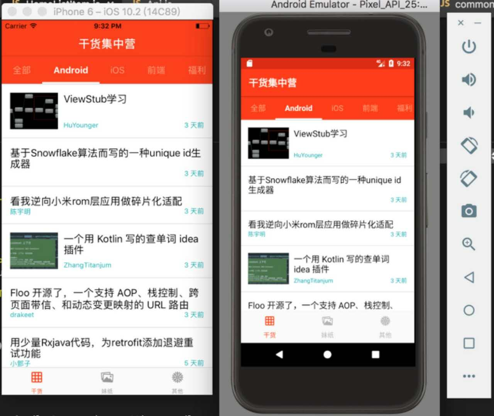
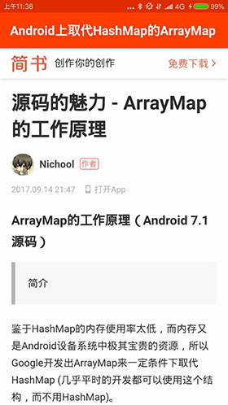

# GankRnApp
干货集中营

[TCP]

> 其实RN开发早就很火了，并且已经成为很多项目的成熟解决方案。前段时间看到了一个开发的新闻资讯类的App-[Reading](https://github.com/attentiveness/reading),感觉真棒，想着如果自己用RN写一个会不会更有趣，毕竟这是自己第一次尝试用RN开发；当然作为从0开发的，很多思路都是借鉴这位大神的，感谢！！！。
### 搭建开发环境
- React Native版本为0.48
- 前期目标平台：Android,开发平台macOS,IDE:vs code
- 开发环境配置：请参考[RN中文社区](http://reactnative.cn/docs/0.48/getting-started.html),此处不再描述
- 接口采用[gank.io](http://www.gank.io)的开放接口,所以这是一个Gank Rn版本
### React Native常用命令

```
1.react-native --version                                  //查看当前reactNative版本
2.sudo npm update -g react-native-cli         //更新全局的reactNative到最新版本
3.npm info react-native        //查看服务器端的reactNative的各版本信息
4.npm install                                      //给下载的普通工程下载安装RN环境,根据配置的package.json
5.react-native upgrade                     //根据package.json配置的RN版本,更新RN环境代码
6.react-native run-android //运行Android工程
7.react-native run-ios //运行IOS工程
8.react-native init 工程名                 //初始化一个工程、下载React Native的所有源代码和依赖包
9.npm install --save react-native@0.18          //项目降级或升级到指定版本,记得react-native upgrade更新一下项目依赖等
10. npm install react-native-storage --save   // 安装某个lib到项目中
```

### 初始化项目

```
react-native init GankRnApp
cd GankRnApp
```
### 运行项目

```
npm install 
npm start #开启服务
```

```
//运行IOS 
react-native run-ios
//运行Android
//第一种方式
react-native run-android
//第二中方式（手动采用gradle编译）
cd android
./gradlew installDebug
```

## 运行截图






## License

Apache License 2.0